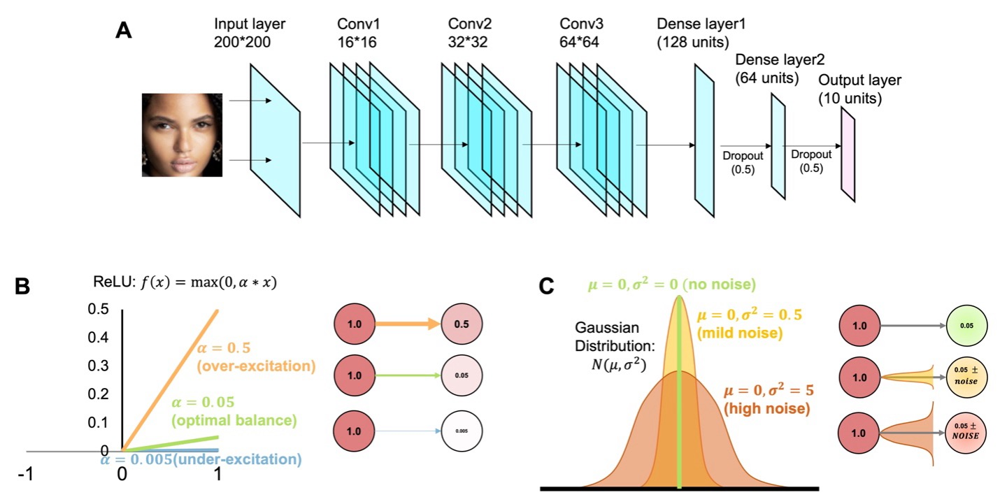

# **A neurocomputational basis of face recognition changes in ASD: E/I balance, internal noise, and weak neural representations**

This research project explores **convolutional neural networks (CNNs)** with two biologically ASD inspired modifications:

- **EIB (E/I Imbalance) Model**: Introduces a custom activation function to simulate **excitatory/inhibitory imbalances**, which are relevant in neuroscience studies (e.g., ASD research).
- **IN (Internal Noise) Model**: Incorporates **Gaussian noise layers** in the network to examine the effects of stochastic internal representations.

These models are evaluated using **correlation analysis of feature representations**, tracking their **learning behavior over extended training epochs**.

---

## **1. Model Structure**

Below is an overview of the CNN architecture used in this study:



---

## **2. Project Structure**

### **📂 Modules Overview**

Each module is responsible for a specific aspect of data processing, model building, training, and analysis.

#### 📂 `src/preprocessing.py`
- **`load_image(image_path)`**: Loads an image from a given path.
- **`resize_image(image, width=None, height=None)`**: Resizes an image while maintaining aspect ratio.
- **`normalize_image(image)`**: Normalizes pixel values to **[0, 1]**.
- **`augment_image(image)`**: Performs optional **data augmentation**.

#### 📂 `src/models.py`
- **`build_base_cnn(input_shape, num_classes)`**: Standard CNN baseline.
- **`build_EIB_cnn(input_shape, num_classes, e_coeff=1.0, i_coeff=1.0)`**:  
  → Implements **E/I Imbalance** via a custom ReLU function.
- **`build_IN_cnn(input_shape, num_classes, noise_std=0.1)`**:  
  → Introduces **Gaussian noise** into the network.
- **`train_model(model, train_data, train_labels, ...)`**:  
  → Trains the model with **block-based train/test splitting**.
- **`evaluate_model(model, test_data, test_labels)`**:  
  → Evaluates **classification accuracy**.

#### 📂 `src/analysis.py`
- **`compute_correlation_matrix(features)`**:  
  → Computes **feature correlation** to analyze representation similarity.
- **`extract_intermediate_features(model, layer_name, data)`**:  
  → Extracts **activations from an intermediate layer**.
- **`compute_pearson_correlation(vec1, vec2)`**:  
  → Computes **Pearson correlation coefficients**.

#### 📂 `src/utils.py`
- **`is_google_colab()`**: Checks if the script is running on Google Colab.
- **`install_missing_packages()`**: Installs missing dependencies **automatically**.

---

## **3. Running the Project**

### **🔹 Installing Dependencies**
To set up your environment, run:

```bash
pip install -r requirements.txt
```

### **🔹 Running Locally**
Execute scripts with Python or use Jupyter Notebooks from the `notebooks/` directory.

### **🔹 Running in Google Colab**
- Clone the repository or manually upload it.
- Run `install_missing_packages()` from `src/utils.py` if necessary.

---

## **4. Training & Evaluation**

### **🧑‍🏫 Training Details**
1. **Choose the desired model:**
   - **`build_EIB_cnn`** (Excitatory/Inhibitory Imbalance)
   - **`build_IN_cnn`** (Internal Noise)
2. **Load and preprocess the dataset.**
3. **Train using** `train_model(...)`.
4. **Evaluate using** `evaluate_model(...)`.

### **📈 Recommended Training Epochs**
Based on the original dataset and experimental settings, the model requires **at least 750 epochs** to show strong correlation effects.

---

## **5. Understanding the `res/` Folder**

All experimental results—including training logs, accuracy/loss records, and feature correlation matrices—are stored in the `res/` folder. Below are examples of how the results are organized for each model type:

### **📂 `res/EIB/` (E/I Imbalance Model Results)**
Example directory structure:

```
res/EIB/750/
    ├── trainedAcc_750.json    # Training Accuracy per epoch
    ├── trainedLoss_750.json    # Training Loss per epoch
    ├── validationAcc_750.json  # Validation Accuracy per epoch
    ├── validationLoss_750.json # Validation Loss per epoch
    ├── cor_output_750_4.json   # Feature correlation at epoch 750 (iteration 4)
```

### **📂 `res/IN/` (Internal Noise Model Results)**
Example directory structure:

```
res/IN/750/
    ├── trainedAcc_750.json
    ├── trainedLoss_750.json
    ├── validationAcc_750.json
    ├── validationLoss_750.json
    ├── cor_output_750_4.json
```

These JSON files contain the performance metrics and correlation data generated during training.

---

## **6. Feature Analysis & Visualization**

After training, analyze the feature representations using the following steps:

1. **Extract Intermediate Features**
   ```python
   features = extract_intermediate_features(model, "conv_layer", test_data)
   ```
2. **Compute Correlation Matrix**
   ```python
   corr_matrix = compute_correlation_matrix(features)
   ```
3. **Plot Correlation Heatmap**
   ```python
   import seaborn as sns
   import matplotlib.pyplot as plt

   sns.heatmap(corr_matrix, cmap="coolwarm", annot=True)
   plt.title("Feature Correlation Heatmap")
   plt.show()
   ```

### **Example: Feature Correlation Heatmap**


---

## **7. Future Work**
- Extend **E/I Imbalance** studies to real-world datasets.
- Compare **Internal Noise (Gaussian)** with other types of stochastic perturbations.
- Explore self-supervised learning approaches with these models.

---

## **8. Contributors**
- **Xijing Wang**
- **Dr. Lang Chen**

---

## **9. License**
This project is released under the **MIT License**.

---

## **10. References**
Waiting for link ...
