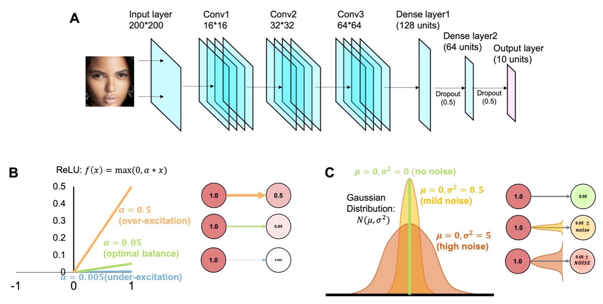

# A neurocomputational basis of face recognition changes in ASD: E/I balance, internal noise, and weak neural representations

This research project explores convolutional neural networks (CNNs) with biologically-inspired modifications to model autism spectrum disorder (ASD) characteristics:

- **E/I Imbalance Model**: Custom activation function simulating excitatory/inhibitory imbalances
- **Internal Noise Model**: Gaussian noise layers modeling stochastic neural representations

---

## 1. Model Structure



---

## 2. Project Structure

### `src/preprocessing.py`
- `load_image(image_path)`: Loads an image from a given path
- `resize_image(image, width, height)`: Resizes an image while maintaining aspect ratio
- `normalize_image(image)`: Normalizes pixel values to [0, 1]
- `augment_image(image)`: Performs data augmentation

### `src/models.py`
- **`CustomActivation(slope_positive, slope_negative, threshold)`**: Custom activation layer supporting:
  - **Thresholded ReLU**: `slope_negative=0.0` (default)
  - **Thresholded Leaky ReLU**: `slope_negative>0.0`
  - Configurable activation threshold

- **`build_cnn(input_shape, slope_positive, slope_negative, threshold, noise_level, filter_size, num_classes, learning_rate, categorical)`**: 
  - Builds CNN with CustomActivation layers
  - Parameters control E/I imbalance simulation and internal noise
  
- `train_model(model, data, labels, n_epochs, batch_size, verbose)`: Trains the model with efficient train/test splitting
- `evaluate_model(model, test_data, test_labels)`: Evaluates classification accuracy

### `src/analysis.py`
- `compute_correlation_matrix(features)`: Computes feature correlation matrices
- `extract_intermediate_features(model, layer_name, data)`: Extracts activations from intermediate layers
- `compute_pearson_correlation(vec1, vec2)`: Computes Pearson correlation coefficients

### `src/utils.py`
- `is_google_colab()`: Checks if running on Google Colab
- `install_missing_packages()`: Installs missing dependencies automatically

---

## 3. Running the Project

### Installing Dependencies
```bash
pip install -r requirements.txt
```

### Running Locally
Execute scripts with Python or use Jupyter Notebooks from the `notebooks/` directory.

### Running in Google Colab
Clone the repository and run `install_missing_packages()` from `src/utils.py` if necessary.

---

## 4. Training & Evaluation

### Training
1. Build model using `build_cnn()` with desired parameters:
   - `slope_negative=0.0` for Thresholded ReLU (E/I Imbalance)
   - `noise_level>0` for Internal Noise model
2. Load and preprocess dataset
3. Train using `train_model()`
4. Evaluate using `evaluate_model()`

### Recommended Training Epochs
At least 750 epochs are recommended to observe strong correlation effects.

---

## 5. Results Directory Structure

Experimental results are stored in `res/` folder:

```
res/EIB/750/
    ├── trainedAcc_750.json
    ├── trainedLoss_750.json
    ├── validationAcc_750.json
    ├── validationLoss_750.json
    └── cor_output_750_4.json
```

---

## 6. Feature Analysis

### Extract and Analyze Features
```python
# Extract intermediate features
features = extract_intermediate_features(model, "layer_name", test_data)

# Compute correlation matrix
corr_matrix = compute_correlation_matrix(features)

# Visualize
import seaborn as sns
import matplotlib.pyplot as plt
sns.heatmap(corr_matrix, cmap="coolwarm")
plt.show()
```


---

## 7. Contributors For Codes
- Xijing Wang
- Dr. Lang Chen

---

## 8. License
MIT License

---

## 9. References
Waiting for link ...
